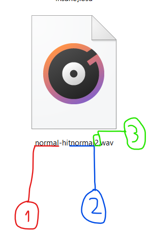

ในหัวข้อพื้นฐานนี้เราจะมาปูพื้นฐานกันก่อนว่า Hitsound นั้นทำอะไรได้บ้างและมีความสำคัญอย่างไร
## Hitsound คืออะไร?
Hitsound คือส่วนประกอบของการ Mapping อย่างนึงที่มีความสำคัญในการสร้างมิติให้กับ Map นั้นๆ ซึ้งต่างกับการวางโน้ตที่จะส่งผลกับ Gameplay โดยตรง ซึ่งจริงๆบางครั้งอาจทำให้ส่งผลกับ Gameplay ได้เช่นกัน *(เนื้อหาส่วนนี้จะไปอยู่ในหัวข้อ [ขั้นสูง](hitsound-advanced.md))* และการมี Hitsound นั้นจำเป็นต่อการ Rank แมพด้วยเช่นกัน
## ส่วนประกอบของ Hitsound
การทำ Hitsound นั้นมีหลายอย่างที่ต้องทำความเข้าใจ Sampleset, addition, Filenamed, Volume แต่ละอย่างจะมีแต่ละส่วนที่ต้องเข้าใจดังนี้
### Filenamed 
 การตั้งชื่อไฟล์หรือ [Sample](#Sample) นั้นส่วนใหญ่จะเป็นวิธีการตั้งชื่อไฟล์จากนอกเกมเพื่อนำไปใช้ในเกมเสียมากกว่า แต่ละเสียงจะมีหมวดหมู่ที่*ค้อนข่าง*ตายตัวอยู่(จะไปพูดเนื้อหาส่วนนี้อีกในส่วน [เบื้องต้น](hitsound-basic.md)) รูปแบบการตั้งชื่อนั้นก็เป็นการตั้งชื่อไฟล์ในรูปแบบที่ตายตัวด้วยเช่นกัน (ในที่นี้จะหมายถึงการคั้งชื่อไฟล์เผื่อนำไปใช้ในโหมด Standard เท่านั้น) จะมีรูปแบบดังนี้

:::
-
**1. Sampleset**
    - จะเป็นส่วนแรกของชื่อไฟล์ที่จะบอกหมวดหมู่ของไฟล์เราว่าอยู่ส่วนไหนจะมีรูปแบบที่ตั้งได้ทั้งหมด 3 รูปแบบ  
    <ul>
 <li>soft</li>
 <li>normal<l/i>
 <li>drum</li>
</ul>

**2. Addition** จะมีรูปแบบที่ตั้งได้ทั้งหมด 4 รูปแบบ  
    <ul>
 <li>hitclap</li>
 <li>hitnormal<l/i>
 <li>hitfinish</li>
 <li>hitwhistle</li>
</ul>

**3. Samplesetnumber**

:::
